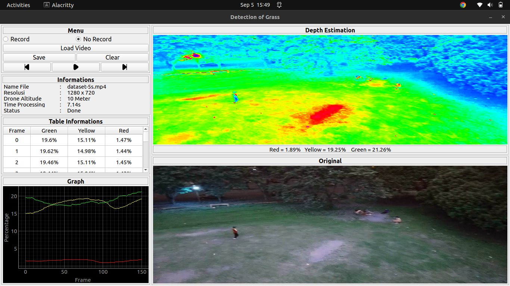

# Telkom University | IEEE System Engineering
Download dataset [here](https://telkomuniversityofficial-my.sharepoint.com/:f:/g/personal/gritzz_student_telkomuniversity_ac_id/Ev6R4hBF7b5OtTedQejpKNgB6ioEOuAG_Oq4bf-FJA340A?e=Xm7a9U)

## Screenshots



## Usage
1. Clone the repository
```bash
git clone https://github.com/aziz-0110/riset-drone.git
cd riset-drone
```
2. Build and activated the virtual environment
```bash 
virtualenv venv
source venv/bin/activate
```
3. Install requitments
```shell
pip install -r requitments.txt 
```
4. Run the app
```shell
python3 controler.py 
```
