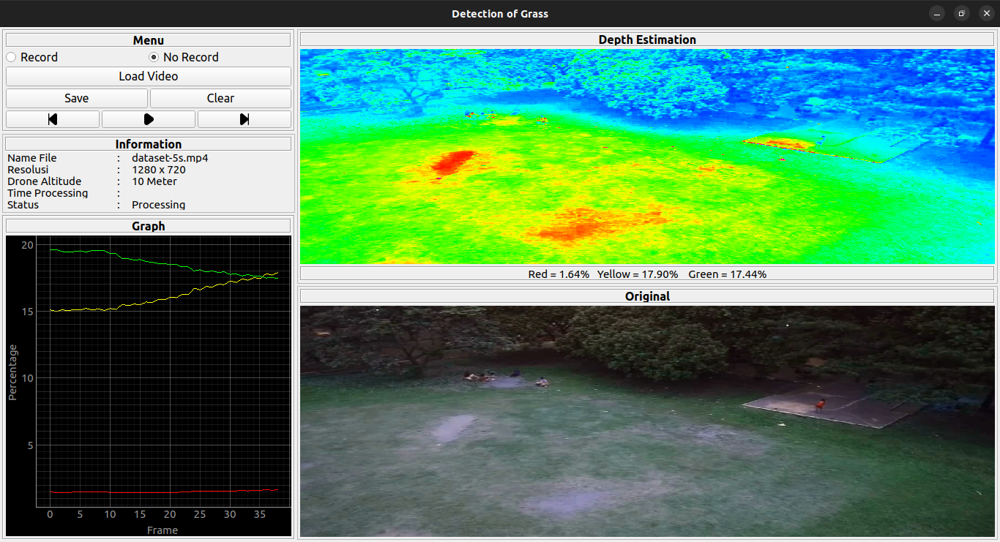

# Telkom University | IEEE System Engineering


## Screenshots



## Usage
1. Build and activated the virtual environment
```bash 
virtualenv venv
source venv/bin/activate
```
2. Clone the repository
```bash
git clone https://github.com/aziz-0110/riset-drone.git
cd riset-drone
```
3. Install requitments
```shell
pip install -r requitments.txt 
```
4. Run the app
```shell
python3 controler.py 
```
